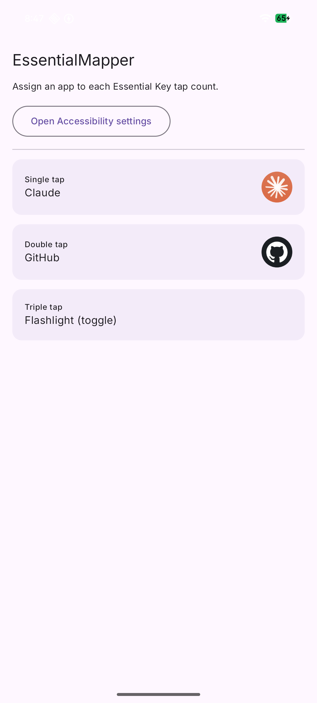

# EssentialMapper

Remap the Nothing Phone (3a) Lite's hardware **Essential Key** to launch an app or
toggle the flashlight by tap count — single, double, or triple. Personal, sideloaded tool.

<p align="center">
  
</p>

Default mapping is **single → Claude · double → Wallet · triple → flashlight**; change any
slot in the app.

## Install

Grab the APK from [Releases](https://github.com/tracpants/essential-mapper/releases)
(debug-signed — fine for sideloading), or build it:

```bash
export JAVA_HOME=/Library/Java/JavaVirtualMachines/temurin-21.jdk/Contents/Home  # Gradle rejects JDK 25
./gradlew :app:assembleDebug
adb install app/build/outputs/apk/debug/app-debug.apk
```

Then open the app and enable it in **Accessibility settings**.

## Freeing the single press

Double- and triple-tap work immediately. The **single** press stays system-owned until you
disable Nothing's Essential surfaces (reversible with `pm enable`):

```bash
adb shell pm disable-user --user 0 com.nothing.ntessentialspace
adb shell pm disable-user --user 0 com.nothing.ntessentialrecorder
adb shell pm disable-user --user 0 com.nothing.essentialintelligence
```

## How it works

An accessibility service with filtered key events matches the Essential Key by
**scanCode 250** — it reports `keyCode=0`, so the scanCode is its only stable identity. Taps
are counted on a 400 ms debounce and dispatched from a DataStore-backed map. Both tunables
live in `EssentialKeyService`.

> ⚠️ scanCode 250 is specific to this device/firmware — no promise it matches other Nothing models.

## Credits

The ADB trick comes from [z3phydev's guide](https://github.com/z3phydev/How-to-remap-or-disable-the-Essential-Key);
the interception approach mirrors [Key Mapper](https://github.com/keymapperorg/KeyMapper).

## License

[MIT](LICENSE) © 2026 Aiden Rudolph. Not affiliated with Nothing.
